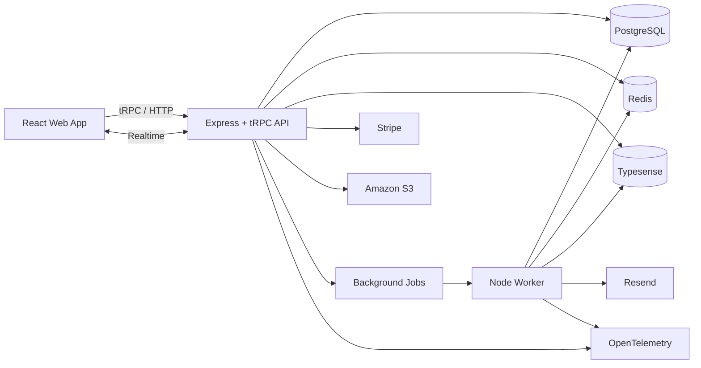

# Eventra

Eventra is a production-style event ticketing platform built to demonstrate full-stack engineering with React, Node.js and TypeScript. It focuses on correctness under concurrency, reliable payment processing, real-time inventory, asynchronous workflows and production-oriented observability.

## Goals

- Let customers discover events, reserve seats, pay securely and receive scannable tickets.
- Let organisers create and manage events, venues, inventory, orders and attendees.
- Prevent double booking under concurrent demand.
- Treat payment callbacks and background work as retryable, idempotent workflows.
- Demonstrate a maintainable modular-monolith architecture rather than unnecessary microservices.

## Technology

**Frontend:** React, TypeScript, React Router, TanStack Query, Tailwind CSS, Radix UI, Zod, React Hook Form.  
**Backend:** Node.js, TypeScript, Express, tRPC, Zod, Drizzle ORM.  
**Data:** PostgreSQL, Redis, Typesense.  
**Infrastructure:** Docker, GitHub Actions, Amazon S3, AWS, OpenTelemetry.  
**External services:** Stripe, Resend, GitHub OAuth, Google OAuth.

## Development prerequisites

Use Node.js 22.13.0 (the version in `.nvmrc`) or a supported Node.js 24+ release.
Then install dependencies with pnpm and run repository commands through pnpm so the
workspace-local tool versions are used:

```sh
nvm use
corepack enable
pnpm install
pnpm lint
```

## Core engineering challenges

- Transaction-safe seat reservations and expiry.
- Idempotent checkout and Stripe webhook handling.
- Real-time seat availability without making Redis authoritative.
- Reliable background processing for expiry, email, ticket generation and indexing.
- Multi-tenant organisation authorization.
- Search synchronization and eventual consistency.
- Tracing, metrics, structured logging and load/concurrency testing.

## Architecture



PostgreSQL is the source of truth for inventory, orders, payments and tickets. Redis is an optimization and coordination layer, not the authority for ticket ownership.

## Documentation

- [Product requirements](docs/product/requirements.md)
- [Scope](docs/product/scope.md)
- [User stories](docs/product/user-stories.md)
- [Roadmap](docs/product/roadmap.md)
- [Domain model](docs/domain/domain-model.md)
- [Business rules](docs/domain/business-rules.md)
- [Invariants](docs/domain/invariants.md)
- [State machines](docs/domain/state-machines.md)
- [Architecture](docs/architecture/overview.md)
- [Database design](docs/architecture/database.md)
- [Concurrency](docs/architecture/concurrency.md)
- [Payments](docs/architecture/payments.md)
- [API contract](docs/api/contract.md)
- [Security](docs/security/threat-model.md)
- [Testing strategy](docs/testing/strategy.md)

## Status

Pre-implementation design. Documentation is a living specification and may change through Architecture Decision Records as implementation reveals new constraints.

## Usage and copyright

Copyright © 2026. All rights reserved.

This repository is publicly available for viewing and educational reference. No permission is granted to copy, modify, distribute, sublicense or use this software or substantial portions of it without prior written permission from the copyright holder.
