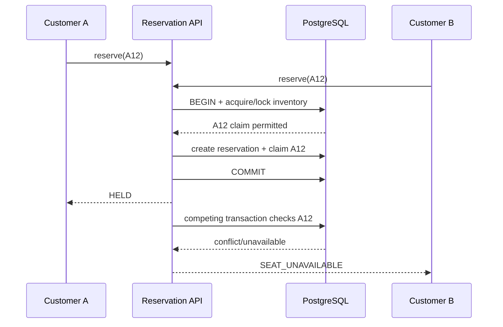

# Reservation Concurrency

## Problem

Two customers may observe the same seat as available and attempt to reserve it simultaneously. UI state, Redis locks or a prior availability read cannot by themselves prevent double booking.

## Authority

PostgreSQL is authoritative. Redis may accelerate notifications/coordination but losing Redis must not allow two customers to own the same inventory.

## Reservation transaction

The intended flow is:

The precise SQL strategy (row-level locking versus conditional atomic update plus uniqueness constraints, and isolation level) will be validated experimentally before ADR-003 becomes final. The invariant is fixed even if the implementation changes.

## Atomicity

Multi-seat requests are all-or-nothing. If A12 succeeds but A13 is unavailable, the transaction rolls back and A12 is not retained by that request.

## Expiry race

A worker may attempt to expire a reservation while checkout is completing. Both operations must coordinate through authoritative transactional state. Completion only succeeds from an eligible active hold; expiry only succeeds from an expirable hold. Conditional state transitions prevent both from winning.

## Payment near expiry

Payment-provider success can arrive after the nominal reservation deadline. The system must define and consistently enforce a policy rather than infer success from timing. Initial policy: checkout may only be initiated for an active hold; once a Stripe payment attempt is legitimately in flight, payment reconciliation must avoid silently losing captured money. Exact grace/reconciliation behavior will be finalized with the Stripe implementation.

## Ticket validation race

Admission uses an atomic conditional update equivalent to `VALID → USED`. Two scanners cannot both receive a successful transition.

## Required concurrency tests

- 2 clients competing for 1 seat: exactly 1 success.
- 100 clients competing for 1 seat: exactly 1 success.
- 1,000 attempts across 100 seats: no seat has more than one effective owner; successes never exceed inventory.
- Multi-seat request conflict: no partial hold remains.
- Expiry vs completion: exactly one legal terminal outcome.
- Two ticket scans: exactly one successful admission.

Benchmark numbers published in the README must be measured, never estimated.
