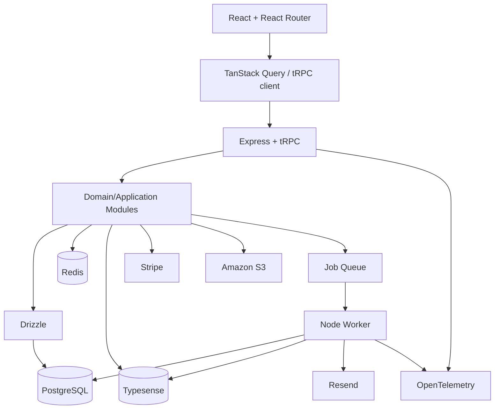

# Architecture Overview

## Style

Eventra uses a **modular monolith**: one primary Node.js/Express application with explicit domain modules, plus independently runnable worker processes for asynchronous jobs. This keeps transactions and development simple while preserving boundaries that could be extracted later if justified.

## Components

## Frontend responsibilities

React renders customer/organiser/admin interfaces. React Router owns navigation. TanStack Query owns server-state fetching/caching and integrates with the tRPC client. React Hook Form and Zod handle forms/client validation. Radix UI provides accessible primitives and Tailwind CSS handles styling. Client validation improves UX but never replaces server validation/authorization.

## Backend responsibilities

Express hosts the application and cross-cutting HTTP middleware. tRPC provides the typed application API. Zod validates boundary input. Domain modules contain authorization and business behavior. Drizzle implements PostgreSQL persistence without making database models the domain API.

Suggested modules: `auth`, `organisations`, `events`, `venues`, `inventory`, `reservations`, `orders`, `payments`, `tickets`, `search`, `notifications`, `admin` and `audit`.

## Data responsibilities

**PostgreSQL:** authoritative transactional state.  
**Redis:** caching, rate limiting, ephemeral coordination/pub-sub and queue-related state where appropriate.  
**Typesense:** denormalized event search index; eventually consistent and rebuildable.

## External boundaries

Stripe handles payment processing; Resend sends transactional email; GitHub/Google provide OAuth identity; S3 stores media/ticket artifacts where appropriate; OpenTelemetry emits traces/metrics/log correlation to configured AWS/observability backends.

## Deployment direction

The target is containerized AWS deployment with separate web/API and worker workloads, managed PostgreSQL/Redis where appropriate, S3 object storage, secrets outside images/source, health checks and GitHub Actions CI/CD. Exact AWS services are deferred until deployment design is required.
