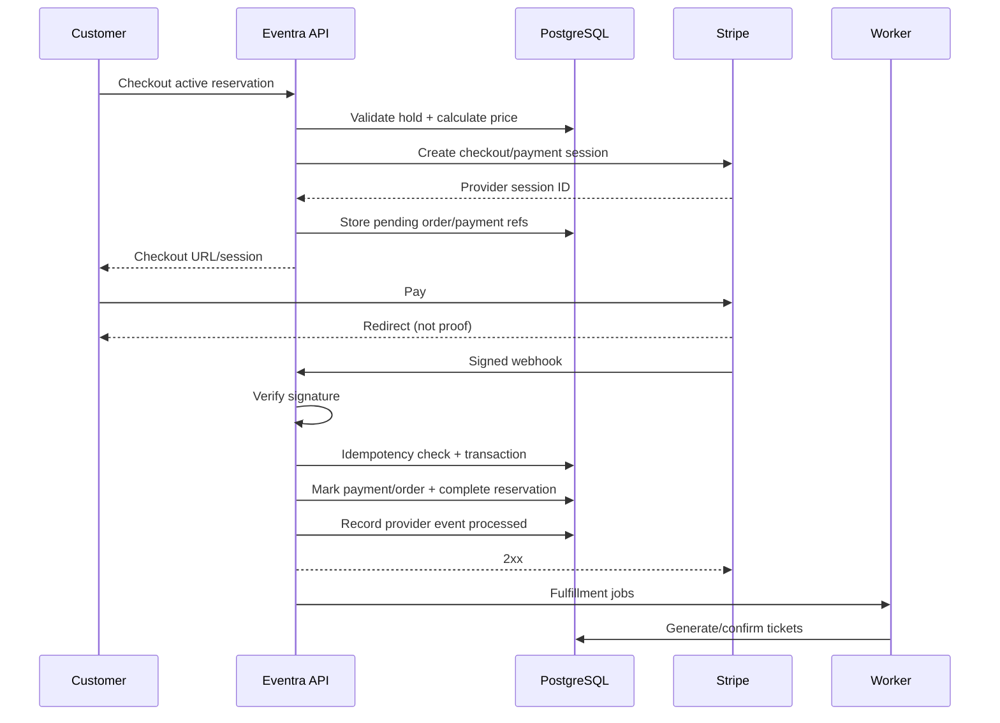

# Payment Architecture

## Principles

Stripe is the payment provider; Eventra owns order, reservation and ticket state. Browser redirects are UX signals, not authoritative payment confirmation. Webhooks are authenticated, idempotent and processed transactionally.

## Flow

## Idempotency

Every Stripe event is identified by provider event ID and stored under a unique constraint. Processing the same event again returns success without repeating fulfillment. Checkout creation should also accept/derive an idempotency key so client retries do not create uncontrolled duplicate attempts.

## Validation

Before fulfillment, verify expected order identity, amount, currency and relevant Stripe metadata. Never accept client-supplied totals as authoritative.

## Failure cases

**Customer closes browser:** webhook processing still completes the order.  
**Duplicate webhook:** idempotency record prevents duplicate business effects.  
**Webhook before redirect:** normal; provider events are independent of browser navigation.  
**Ticket/email worker failure:** paid order remains paid; jobs retry.  
**Stripe unavailable during checkout creation:** no payment is assumed; return a controlled retryable error.  
**Captured payment cannot be fulfilled:** record an operational exception and reconcile/refund rather than hiding the captured payment.

## Refunds

Refund request → authorization/policy validation → Stripe refund request → provider confirmation/webhook → update refund/payment/order/ticket state → notify customer. Repeated requests/events must remain idempotent and cumulative refunds cannot exceed captured value.
