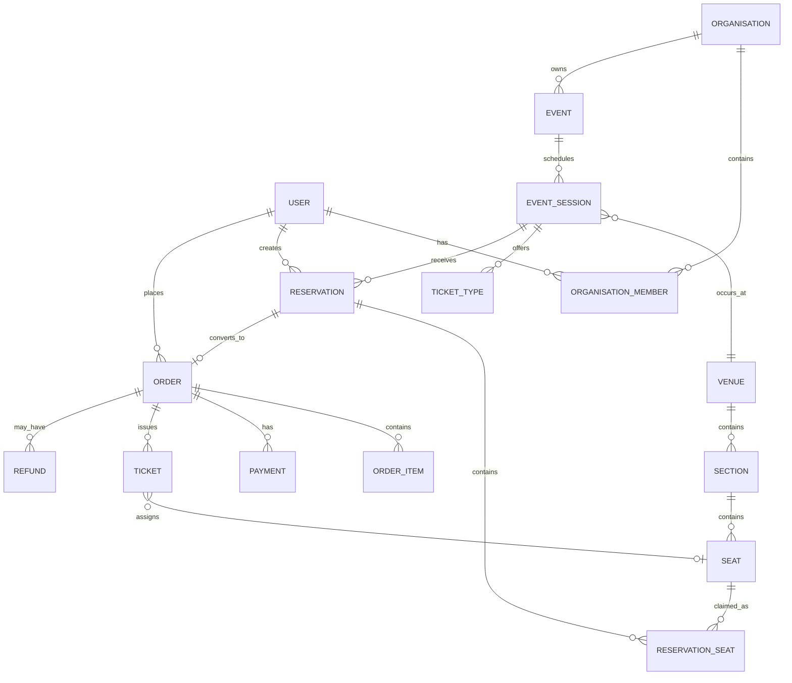

# Domain Model

The domain model describes business concepts independently of Drizzle/PostgreSQL implementation details.

## Ownership

An organisation owns events and controls staff access. An event contains scheduled sessions. A session occurs at a venue and exposes purchasable ticket types/inventory. A customer creates a reservation for one session. A successful checkout converts the reservation into an order; successful payment permits ticket issuance.

## Important distinctions

**Event vs session:** an event is the conceptual listing; a session is a particular occurrence at a time and venue. Inventory belongs to a session.

**Reservation vs order:** a reservation is temporary inventory ownership; an order is a commercial record. They have separate lifecycles.

**Seat vs inventory:** a seat describes physical layout. Availability is session-specific and must not be represented as a permanent `seat.available` flag.

**Payment vs order:** provider payment state and application order state are related but separate, allowing reconciliation and failure recovery.
