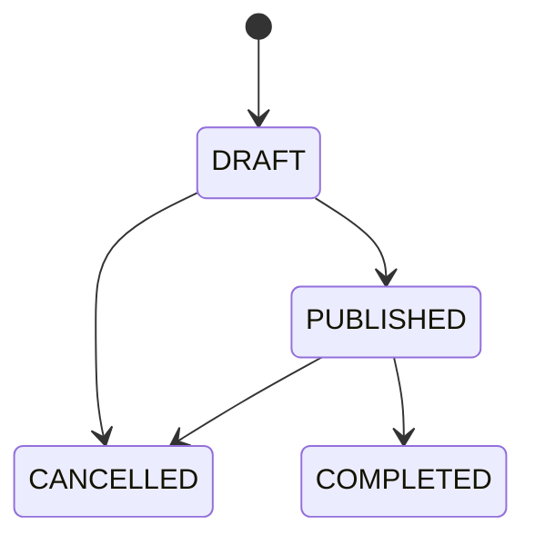
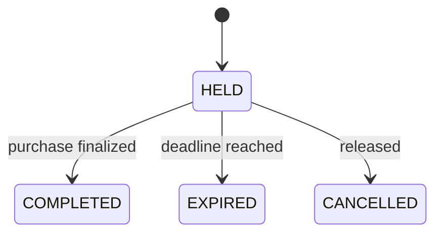
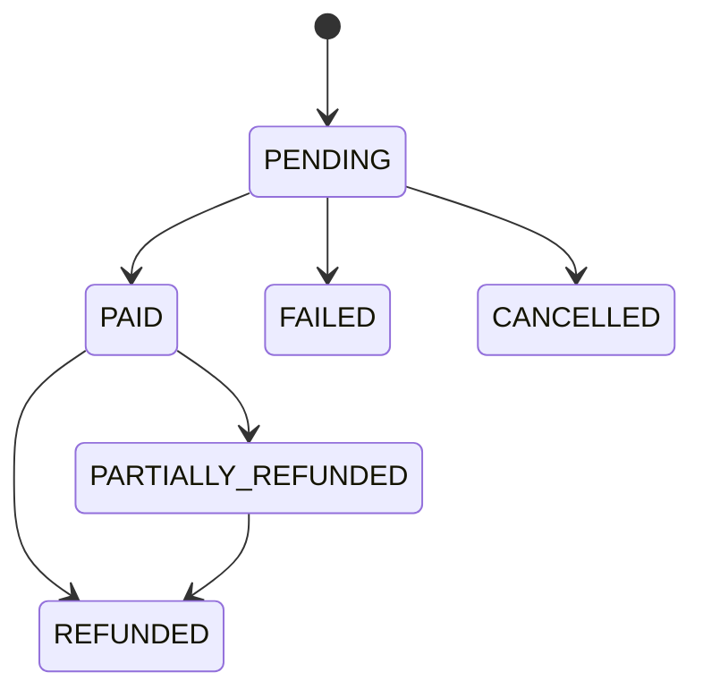
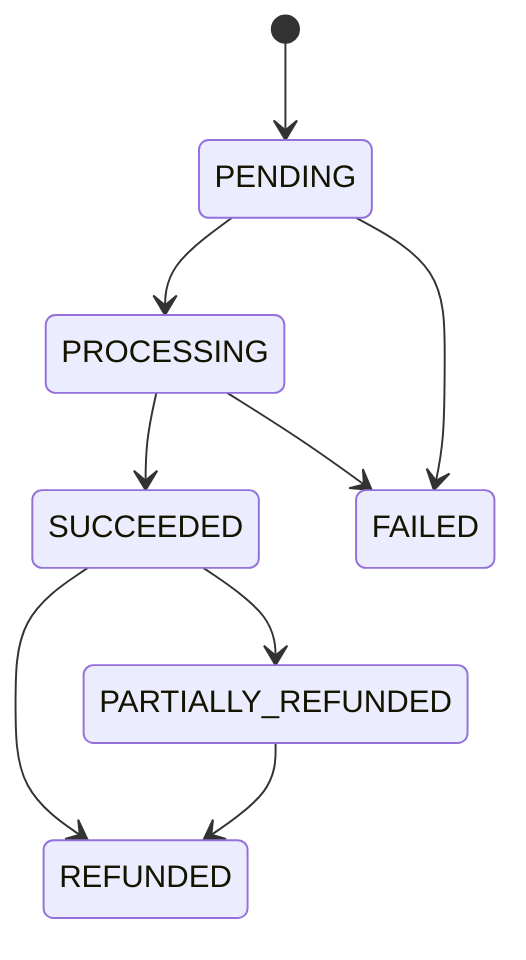
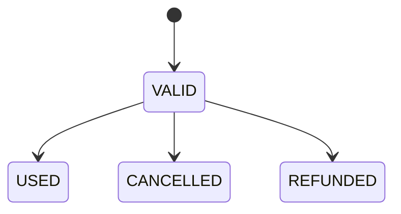

# State Machines

Only explicit transitions are legal. Application services should reject unsupported transitions rather than silently coercing state.

## Event

## Reservation

`EXPIRED → COMPLETED` and `CANCELLED → COMPLETED` are illegal without creating/reacquiring a valid hold.

## Order

## Payment

Provider-specific statuses are mapped into domain states rather than leaked throughout business logic.

## Ticket

USED is terminal for admission purposes. Refund policy for an already-used ticket is a separate commercial decision and must not make it valid again.
